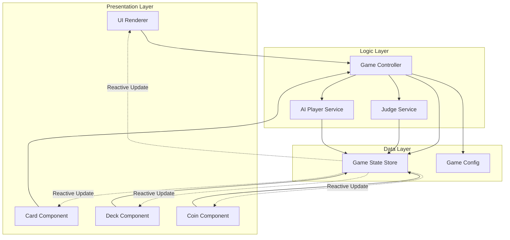
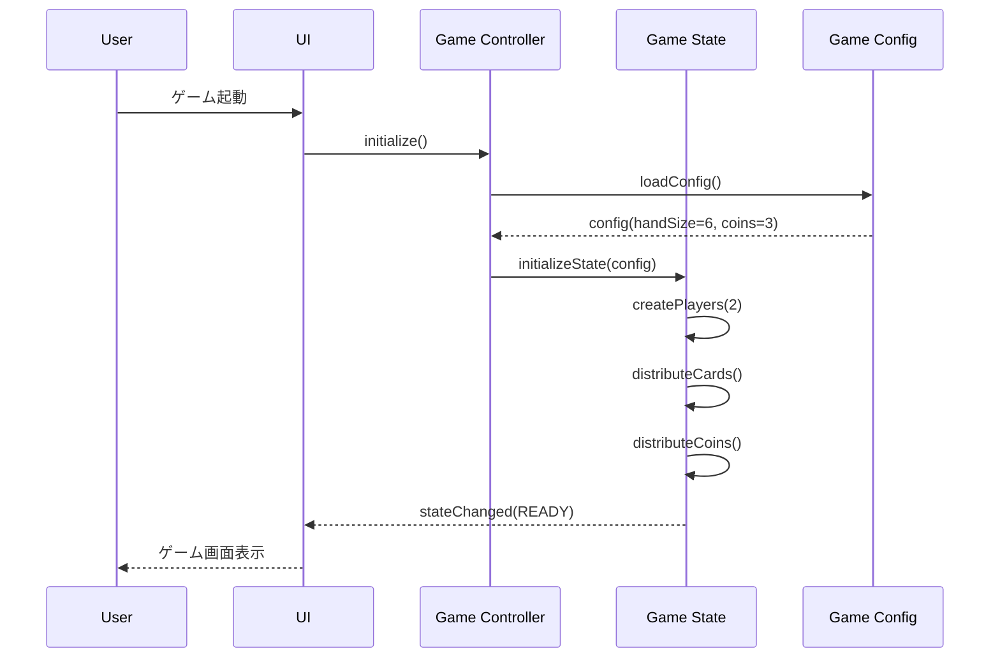
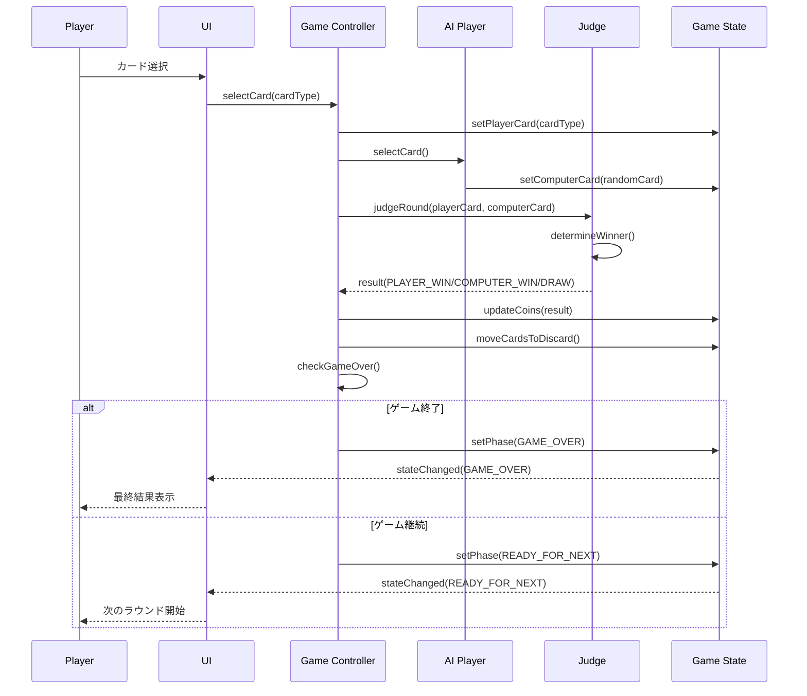
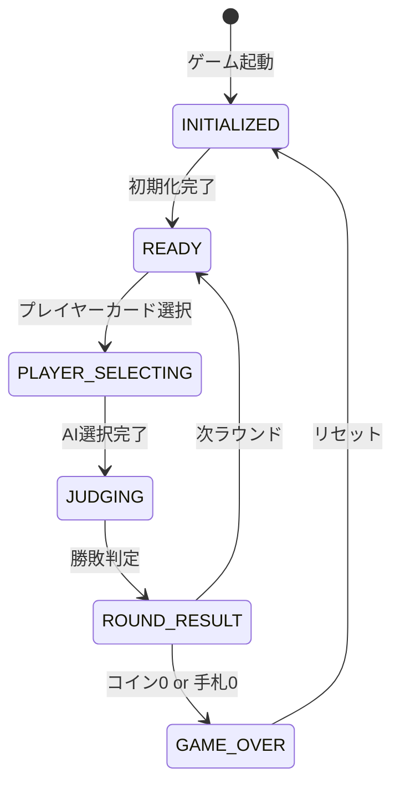
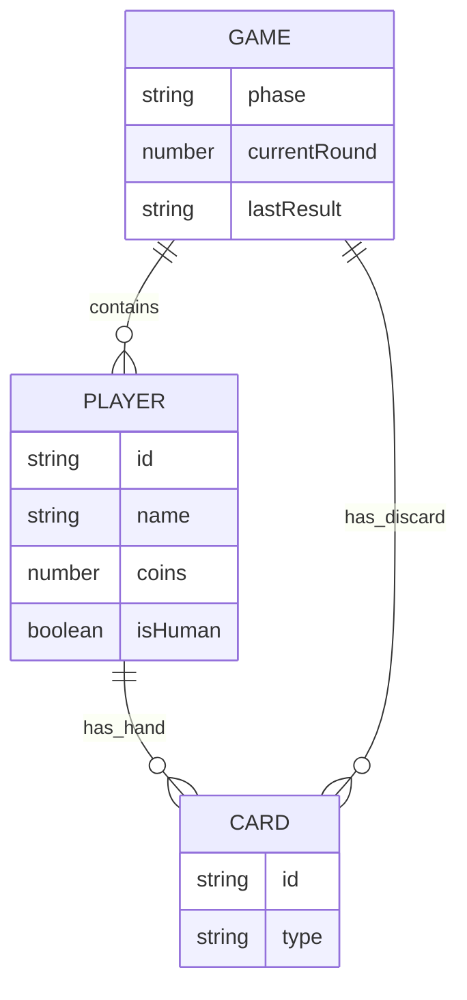
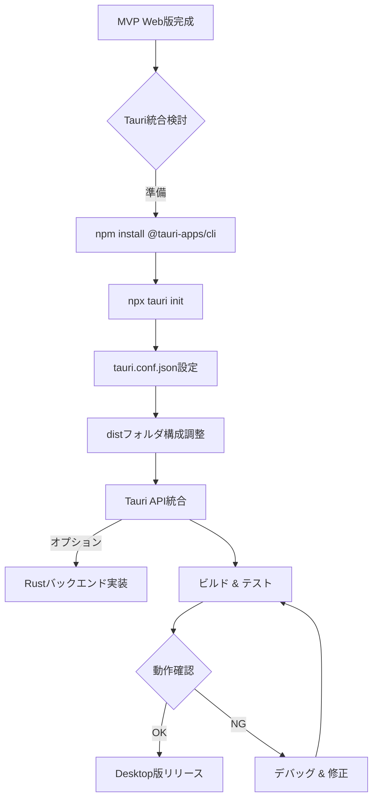

# Technical Design Document

## Overview

本機能は、カードベースのじゃんけんゲームをブラウザで実装し、プレイヤーとコンピュータが手札(グー・チョキ・パー各2枚)から戦略的にカードを選択して対戦するゲーム体験を提供します。

**Purpose**: プレイヤーに対し、トランプのようなカードを使用した戦略的じゃんけんゲームを提供し、コイン駆け引きによるゲーム性を実現します。

**Users**: 一般的なWebブラウザユーザーが、デスクトップまたはモバイルブラウザでプレイします。

**Impact**: 新規開発のため既存システムへの影響はありません。将来的にRust/Tauriでのデスクトップアプリ版への移行を考慮した設計となります。

### Goals

- ブラウザで動作するカードベースじゃんけんゲームの実装
- 手札管理、コイン駆け引き、勝敗判定の正確な実装
- 手札枚数、コイン数、プレイヤー数を設定で変更可能な拡張性の確保
- 将来のTauri desktop版への移行を容易にするフレームワーク非依存設計

### Non-Goals

- リアルタイム多人数オンライン対戦機能(将来の拡張候補)
- カードアニメーション(MVP版は静止画のみ)
- モバイルネイティブアプリ版(ブラウザ版のみ)
- ユーザー認証・ランキングシステム
- サウンドエフェクト・BGM

## Architecture

### Architecture Pattern & Boundary Map

**選択パターン**: Component-based Architecture with Layered Design



**Architecture Integration**:
- **選択パターン**: Component-based + Layered architecture
  - Presentation Layer: UI表示とユーザー入力処理
  - Logic Layer: ゲームロジックとビジネスルール
  - Data Layer: 状態管理と設定
- **Domain/Feature Boundaries**:
  - カード管理ドメイン(手札、デッキ)
  - ゲーム進行ドメイン(ターン管理、勝敗判定)
  - プレイヤー管理ドメイン(人間、AI)
- **新規コンポーネントの根拠**:
  - Reactive Store: 状態変更の自動UI更新のため
  - Judge Service: じゃんけん判定ロジックの分離とテスト容易性
  - AI Player Service: コンピュータの戦略ロジック分離(将来の拡張性)
- **Steering準拠**: フレームワーク非依存、モジュラー設計、型安全性重視

### Technology Stack

| Layer | Choice / Version | Role in Feature | Notes |
|-------|------------------|-----------------|-------|
| Frontend | Vanilla JavaScript (ES6+) | UI実装、イベント処理、DOM操作 | フレームワーク非依存でTauri移行容易 |
| Frontend | HTML5 + CSS3 | マークアップ、スタイリング | Flexboxレイアウト、レスポンシブ対応 |
| Runtime | Modern Browser (ES6+ support) | 実行環境 | Chrome 49+, Firefox 18+, Safari 10+, Edge 12+ (Proxy API対応) |
| Build Tool | Vite (optional) | 開発サーバ、バンドル | MVP版では不要、将来の最適化用 |
| Future Migration | Tauri 2.0 + Rust | Desktop app化 | 製品版で使用、MVP版では未使用 |

**ターゲットブラウザ詳細**:
- **Chrome**: 49以降 (2016年3月～) - Proxy API対応
- **Firefox**: 18以降 (2013年1月～) - Proxy API対応
- **Safari**: 10以降 (2016年9月～) - Proxy API対応
- **Edge**: 12以降 (2015年7月～) - Proxy API対応
- **非対応**: Internet Explorer (全バージョン)

**技術選定の根拠**:
- Vanilla JS: フレームワークオーバーヘッド回避、Tauri移行の容易さ、学習コスト低減
- HTML/CSS: 静止画要件でCanvas不要、DOM操作のシンプルさ
- Vite: 将来的なバンドル最適化とTypeScript導入の選択肢
- Tauri: 将来のデスクトップアプリ化、軽量(Electronより高速)

詳細な調査結果は`research.md`を参照。

## System Flows

### ゲーム初期化フロー



**Key Decisions**:
- 設定値はGameConfigから読み込み、拡張性を確保
- 状態変更はReactive Storeで自動UI更新
- プレイヤー数は配列で管理し、多人数対戦拡張に対応

### カード選択と勝敗判定フロー



**Key Decisions**:
- AIの選択はランダム(MVP版)、将来的に戦略ロジック追加可能
- 勝敗判定はJudge Serviceで分離、テスト容易性確保
- ゲーム終了チェックはラウンド毎に実行(コイン0または手札0)

### ゲーム状態遷移フロー



## Requirements Traceability

| Requirement | Summary | Components | Interfaces | Flows |
|-------------|---------|------------|------------|-------|
| 1.1, 1.2, 1.3, 1.4, 1.5 | ゲーム初期化 | GameController, GameState, GameConfig | GameController.initialize() | ゲーム初期化フロー |
| 2.1, 2.2, 2.3, 2.4, 2.5 | 手札管理 | GameState, CardComponent, UIRenderer | GameState.hand[], CardComponent.render() | - |
| 3.1, 3.2, 3.3, 3.4, 3.5 | カード選択 | GameController, AIPlayer, UIRenderer | GameController.selectCard() | カード選択フロー |
| 4.1, 4.2, 4.3, 4.4, 4.5, 4.6, 4.7 | 勝敗判定 | JudgeService, GameController | JudgeService.judgeRound() | 勝敗判定フロー |
| 5.1, 5.2, 5.3, 5.4, 5.5, 5.6, 5.7 | コイン管理 | GameState, GameController, CoinComponent | GameState.coins[], GameController.updateCoins() | 勝敗判定フロー |
| 6.1, 6.2, 6.3, 6.4, 6.5 | デッキ管理 | GameState, DeckComponent | GameState.discard[], DeckComponent.render() | カード選択フロー |
| 7.1, 7.2, 7.3, 7.4, 7.5, 7.6, 7.7 | ゲーム終了条件 | GameController, GameState | GameController.checkGameOver() | ゲーム状態遷移フロー |
| 8.1, 8.2, 8.3, 8.4, 8.5, 8.6, 8.7 | UI表示要件 | UIRenderer, CardComponent, DeckComponent, CoinComponent | UIRenderer.render() | - |
| 9.1, 9.2, 9.3, 9.4, 9.5 | ゲームリセット | GameController, GameState | GameController.reset() | ゲーム初期化フロー |
| 10.1, 10.2, 10.3, 10.4 | 拡張性要件 | GameConfig, GameController, GameState | GameConfig object | - |

## Components and Interfaces

### Component Summary

| Component | Domain/Layer | Intent | Req Coverage | Key Dependencies (P0/P1) | Contracts |
|-----------|--------------|--------|--------------|--------------------------|-----------|
| GameConfig | Data | ゲーム設定値の集約 | 10.1, 10.2, 10.3 | None | State |
| GameState | Data | ゲーム状態の集中管理 | 1, 2, 5, 6 | GameConfig (P0) | State |
| GameController | Logic | ゲームフロー制御 | 1, 3, 4, 7, 9 | GameState (P0), JudgeService (P0), AIPlayer (P0) | Service |
| JudgeService | Logic | じゃんけん勝敗判定 | 4 | None | Service |
| AIPlayer | Logic | コンピュータ戦略 | 3 | GameState (P1) | Service |
| UIRenderer | Presentation | メイン画面描画 | 8 | GameState (P0), CardComponent (P1), DeckComponent (P1), CoinComponent (P1) | - |
| CardComponent | Presentation | カード表示 | 2, 8 | GameState (P0) | - |
| DeckComponent | Presentation | デッキ表示 | 6, 8 | GameState (P0) | - |
| CoinComponent | Presentation | コイン表示 | 5, 8 | GameState (P0) | - |

### Data Layer

#### GameConfig

| Field | Detail |
|-------|--------|
| Intent | ゲーム設定値(手札枚数、コイン数、プレイヤー数)の集約 |
| Requirements | 10.1, 10.2, 10.3 |

**Responsibilities & Constraints**
- 設定値のデフォルト値定義
- 設定値の読み込みと検証
- Immutableオブジェクトとして扱う

**Dependencies**
- None

**Contracts**: State [x]

##### State Management

```typescript
interface GameConfig {
  handSize: number;          // 初期手札枚数(デフォルト: 6)
  initialCoins: number;      // 初期コイン数(デフォルト: 3)
  playerCount: number;       // プレイヤー数(デフォルト: 2, 将来拡張用)
  cardTypes: CardType[];     // カード種類(デフォルト: [ROCK, PAPER, SCISSORS])
}

type CardType = 'ROCK' | 'PAPER' | 'SCISSORS';
```

**Implementation Notes**
- Integration: ゲーム初期化時にGameControllerが読み込み
- Validation: handSize > 0, initialCoins > 0, playerCount >= 2
- Risks: なし(静的設定値)

#### GameState

| Field | Detail |
|-------|--------|
| Intent | ゲーム状態(手札、コイン、デッキ、フェーズ)の集中管理とリアクティブ更新 |
| Requirements | 1, 2, 5, 6 |

**Responsibilities & Constraints**
- ゲーム状態のカプセル化
- 状態変更の検知とUIへの通知(Proxy-based reactive store)
- 状態変更の単一経路保証

**Dependencies**
- Inbound: GameController, JudgeService, AIPlayer — 状態読み書き (P0)
- Inbound: UIRenderer, CardComponent, DeckComponent, CoinComponent — 状態購読 (P0)
- Outbound: GameConfig — 初期化時の設定読み込み (P0)

**Contracts**: State [x]

##### State Management

```typescript
type GamePhase = 'INITIALIZED' | 'READY' | 'PLAYER_SELECTING' | 'JUDGING' | 'ROUND_RESULT' | 'GAME_OVER';

type RoundResult = 'PLAYER_WIN' | 'COMPUTER_WIN' | 'DRAW';

interface Card {
  type: CardType;
  id: string;  // ユニークID
}

interface Player {
  id: string;
  name: string;
  hand: Card[];        // 手札
  coins: number;       // コイン数
  isHuman: boolean;    // 人間プレイヤーかAIか
}

interface GameStateData {
  phase: GamePhase;
  players: Player[];           // プレイヤー配列(多人数拡張用)
  discard: Card[];             // 使用済カード(デッキ)
  currentRound: number;        // 現在のラウンド数
  lastResult: RoundResult | null;
  selectedCards: Map<string, Card>;  // playerId -> selected card
}

interface GameStateStore {
  state: GameStateData;
  subscribe(listener: (state: GameStateData) => void): () => void;
  setState(partial: Partial<GameStateData>): void;
  getState(): Readonly<GameStateData>;
}
```

**Persistence & Consistency**:
- ブラウザメモリ内のみ、永続化なし(MVP版)
- 状態変更は単一経路(setState)のみ、直接変更禁止
- Reactive更新はJavaScript Proxyで実装

**Concurrency Strategy**:
- シングルスレッド、並行性制御不要

**Implementation Notes**
- Integration: Proxyでstate変更を検知、subscribeで登録されたリスナーに通知
- Validation: setState内でphase遷移の妥当性検証
- Risks: Proxy非対応ブラウザ(IE11以下)は未サポート、ターゲット外と想定

### Logic Layer

#### GameController

| Field | Detail |
|-------|--------|
| Intent | ゲーム全体のフロー制御、イベントハンドリング、状態遷移管理 |
| Requirements | 1, 3, 4, 7, 9 |

**Responsibilities & Constraints**
- ゲームライフサイクル管理(初期化、リセット)
- ユーザー入力の受付とバリデーション
- ラウンド進行制御
- ゲーム終了判定

**Dependencies**
- Inbound: UIRenderer — ユーザーアクション (P0)
- Outbound: GameState — 状態読み書き (P0)
- Outbound: JudgeService — 勝敗判定 (P0)
- Outbound: AIPlayer — AI選択 (P0)
- Outbound: GameConfig — 設定読み込み (P0)

**Contracts**: Service [x]

##### Service Interface

```typescript
interface GameControllerService {
  initialize(): void;
  selectCard(playerId: string, card: Card): Result<void, InvalidCardError>;
  checkGameOver(): GameOverResult | null;
  reset(): void;
}

type Result<T, E> = { ok: true; value: T } | { ok: false; error: E };

interface InvalidCardError {
  code: 'CARD_NOT_IN_HAND' | 'NOT_PLAYER_TURN' | 'INVALID_PHASE';
  message: string;
}

interface GameOverResult {
  winner: string;  // playerId
  reason: 'COINS_DEPLETED' | 'HAND_EXHAUSTED';
  finalScores: Map<string, number>;  // playerId -> coins
}
```

**Preconditions**:
- initialize(): GameStateがINITIALIZED状態
- selectCard(): phase === 'PLAYER_SELECTING' または 'READY', カードが手札に存在
- checkGameOver(): ラウンド終了後
- reset(): 任意のphase

**Postconditions**:
- initialize(): phase === 'READY', 全プレイヤーに手札とコイン配布
- selectCard(): 成功時、カードがselectedCardsに記録、両者選択完了でJUDGING phaseへ遷移
- checkGameOver(): ゲーム終了条件満たす場合、GAME_OVER phaseに遷移
- reset(): phase === 'INITIALIZED', 全状態クリア

**Invariants**:
- 1ラウンドに各プレイヤー1枚のみカード選択可能
- GAME_OVERまたはRESET以外では状態が一貫性を保つ

**Implementation Notes**
- Integration: UIRendererがDOM eventをGameControllerメソッドにバインド
- Validation: カード選択時、手札存在チェック、phase検証
- Risks: 状態遷移ロジックの複雑化 → 状態機械パターンで明確化

#### JudgeService

| Field | Detail |
|-------|--------|
| Intent | じゃんけんの勝敗判定ロジック |
| Requirements | 4 |

**Responsibilities & Constraints**
- カード種類の比較と勝敗判定
- 引き分け判定
- 純粋関数として実装(状態を持たない)

**Dependencies**
- None

**Contracts**: Service [x]

##### Service Interface

```typescript
interface JudgeServiceInterface {
  judgeRound(card1: Card, card2: Card): RoundResult;
}

type RoundResult = 'PLAYER_WIN' | 'COMPUTER_WIN' | 'DRAW';
```

**Preconditions**:
- card1, card2が有効なCardTypeを持つ

**Postconditions**:
- じゃんけんルールに基づいた正しい判定結果

**Invariants**:
- 同じカード種類の組み合わせは常に同じ結果

**Implementation Notes**
- Integration: GameControllerがラウンド終了時に呼び出し
- Validation: カード種類の妥当性検証(ROCK/PAPER/SCISSORS)
- Risks: なし(シンプルなロジック)

#### AIPlayer

| Field | Detail |
|-------|--------|
| Intent | コンピュータプレイヤーのカード選択戦略 |
| Requirements | 3 |

**Responsibilities & Constraints**
- AI手札からのランダムカード選択(MVP版)
- 将来的に戦略ロジック追加可能な設計

**Dependencies**
- Outbound: GameState — AI手札読み取り (P1)

**Contracts**: Service [x]

##### Service Interface

```typescript
interface AIPlayerService {
  selectCard(playerId: string): Card;
}
```

**Preconditions**:
- playerIdが有効なAIプレイヤー
- AI手札に1枚以上のカード

**Postconditions**:
- AI手札から1枚のカードを返す

**Invariants**:
- 返されるカードは必ず手札内に存在

**Implementation Notes**
- Integration: GameControllerがプレイヤー選択後に呼び出し
- Validation: 手札枚数 > 0 チェック
- Risks: ランダム選択の偏り → Math.random()で十分(MVP版)

### Presentation Layer

#### UIRenderer

| Field | Detail |
|-------|--------|
| Intent | メイン画面の描画とGameStateの購読 |
| Requirements | 8 |

**Responsibilities & Constraints**
- DOMの初期構築
- GameState変更のリスニングとUI更新
- 子コンポーネント(Card, Deck, Coin)の管理

**Dependencies**
- Outbound: GameState — 状態購読 (P0)
- Outbound: CardComponent, DeckComponent, CoinComponent — 描画 (P1)

**Implementation Notes**
- Integration: GameState.subscribe()でリアクティブ更新
- Validation: DOM要素の存在確認
- Risks: なし

#### CardComponent

| Field | Detail |
|-------|--------|
| Intent | カード表示とクリックイベント処理 |
| Requirements | 2, 8 |

**Responsibilities & Constraints**
- カード種類に応じたビジュアル表示
- 選択状態のハイライト
- クリックイベントのGameControllerへの委譲

**Dependencies**
- Outbound: GameState — 手札状態読み取り (P0)

**Implementation Notes**
- Integration: HTML button要素、CSS classでスタイル切り替え
- Validation: カード種類の妥当性
- Risks: なし

#### DeckComponent

| Field | Detail |
|-------|--------|
| Intent | 使用済カード(デッキ)の表示 |
| Requirements | 6, 8 |

**Responsibilities & Constraints**
- デッキ内カード枚数表示
- カード種類の視覚的表示(裏向きまたは表向き)

**Dependencies**
- Outbound: GameState — discard配列読み取り (P0)

**Implementation Notes**
- Integration: HTML div要素、CSS Gridレイアウト
- Validation: なし
- Risks: なし

#### CoinComponent

| Field | Detail |
|-------|--------|
| Intent | プレイヤーとコンピュータのコイン数表示 |
| Requirements | 5, 8 |

**Responsibilities & Constraints**
- 各プレイヤーのコイン数の視覚的表示
- コイン増減のアニメーション(将来拡張)

**Dependencies**
- Outbound: GameState — players[].coins読み取り (P0)

**Implementation Notes**
- Integration: HTML span要素、数値表示
- Validation: なし
- Risks: なし

## Data Models

### Domain Model

**Aggregates**:
- **Game Aggregate**: ゲーム全体の整合性を保証
  - Root: GameState
  - Entities: Player, Card
  - Value Objects: GamePhase, RoundResult, CardType

**Transactional Boundaries**:
- ラウンド単位のトランザクション(カード選択 → 判定 → コイン更新 → デッキ追加)

**Business Rules & Invariants**:
- プレイヤーのコイン数は0以上
- 手札枚数は0以上
- 使用済カードは必ずデッキに移動
- 1ラウンドで各プレイヤー1枚のみ選択

### Logical Data Model

**Structure Definition**:



**Entity Relationships**:
- Game 1 : N Player (1ゲームに2人以上のプレイヤー)
- Player 1 : N Card (1プレイヤーに0-6枚の手札)
- Game 1 : N Card (1ゲームに0-12枚のデッキ)

**Attributes and Types**:
- Game.phase: enum GamePhase
- Game.currentRound: number (1から開始)
- Player.id: string (UUID)
- Player.coins: number (0以上)
- Card.type: enum CardType

**Natural Keys**:
- Player.id: プレイヤー識別子
- Card.id: カード識別子(手札とデッキ間の移動追跡用)

**Referential Integrity**:
- Playerは必ずGameに所属
- Cardは必ずPlayerの手札またはGameのデッキに所属

**Consistency & Integrity**:
- ラウンド単位のトランザクション境界
- 状態変更は単一経路(GameState.setState)のみ
- カード総数の保存則: 各プレイヤーの手札枚数 + デッキ枚数 = 初期総数(12枚)

### Physical Data Model

MVP版ではブラウザメモリ内のJavaScriptオブジェクトとして管理。永続化なし。

将来的な拡張(セーブ機能)では以下を検討:
- localStorage: シンプルなJSON保存
- IndexedDB: 構造化データ保存

## Error Handling

### Error Strategy

明確なエラー分類と適切なユーザーフィードバックにより、プレイヤー体験を損なわない。

### Error Categories and Responses

**User Errors (クライアントサイド)**:
- **Invalid Card Selection**:
  - 条件: 手札にないカードの選択、タイミング外の選択
  - 応答: UIでカード選択を無効化、ツールチップで理由表示
  - エラーコード: `CARD_NOT_IN_HAND`, `NOT_PLAYER_TURN`, `INVALID_PHASE`
- **Invalid Phase Transition**:
  - 条件: 不正な状態遷移リクエスト
  - 応答: アクション無視、現在のphase維持
  - エラーコード: `INVALID_PHASE_TRANSITION`

**System Errors (想定外)**:
- **State Corruption**:
  - 条件: GameStateの整合性不一致
  - 応答: ゲームリセット、エラーログ出力(console.error)
  - リカバリ: リセットボタン表示
- **Unexpected Exception**:
  - 条件: JavaScriptランタイムエラー
  - 応答: エラーメッセージ表示、ゲームリセット提案
  - ログ: window.onerrorでキャッチ、console.error

**Business Logic Errors**:
- **Coin Depletion**:
  - 条件: コイン数が0になる
  - 応答: ゲーム終了、勝者表示
  - 正常フロー: checkGameOver()で処理
- **Hand Exhaustion**:
  - 条件: 全手札使用済
  - 応答: ゲーム終了、コイン数比較で勝者決定
  - 正常フロー: checkGameOver()で処理

### Monitoring

MVP版では以下の最小限のログ:
- console.log: ゲームフロー(初期化、ラウンド結果)
- console.error: エラー発生時
- 将来拡張: Sentryなどのエラートラッキングサービス統合

## Testing Strategy

### Test Framework & Infrastructure

| Category | Tool / Framework | Rationale |
|----------|------------------|-----------|
| Unit Tests | Vitest | Vite互換、高速、ESM対応、TypeScript型定義サポート |
| Integration Tests | Vitest | Unit testと同一環境で効率的 |
| E2E Tests | Playwright | MCP統合済み、実ブラウザテスト、スクリーンショット機能 |
| Coverage Tool | Vitest Coverage (c8) | カバレッジ計測とレポート生成 |

**テストファイル構成**:
```
tests/
├── unit/
│   ├── JudgeService.test.js
│   ├── AIPlayer.test.js
│   ├── GameController.test.js
│   └── GameState.test.js
├── integration/
│   ├── game-flow.test.js
│   ├── reactive-update.test.js
│   └── reset-flow.test.js
└── e2e/
    ├── full-game.spec.js
    ├── win-condition.spec.js
    └── reset-feature.spec.js
```

**カバレッジ目標**:
- Logic Layer: 80%以上（GameController, JudgeService, AIPlayer）
- Data Layer: 70%以上（GameState, GameConfig）
- Presentation Layer: 60%以上（UI components）

### Unit Tests

1. **JudgeService.judgeRound()**: 全じゃんけん組み合わせ(9パターン)の正確な判定
2. **GameController.selectCard()**: カード選択のバリデーション(手札存在、phase検証)
3. **GameController.checkGameOver()**: ゲーム終了条件(コイン0、手札0)
4. **AIPlayer.selectCard()**: ランダム選択が手札内カードを返すこと
5. **GameState.setState()**: 状態変更とリスナー通知

### Integration Tests

1. **ゲーム初期化フロー**: GameController.initialize() → GameState初期化 → UI描画
2. **1ラウンド完全フロー**: カード選択 → AI選択 → 判定 → コイン更新 → デッキ追加
3. **ゲーム終了フロー**: コイン0または手札0 → checkGameOver() → GAME_OVER phase
4. **リセットフロー**: GameController.reset() → 全状態クリア → 初期化
5. **Reactive更新**: GameState変更 → UIRenderer購読リスナー発火 → DOM更新

### E2E Tests

1. **ゲーム起動からプレイまで**: ページロード → カード選択 → 結果表示
2. **複数ラウンドプレイ**: 3ラウンド連続プレイ → スコア正確性
3. **勝利条件達成**: プレイヤーがコンピュータのコインを0にする → 勝利画面
4. **敗北条件達成**: コンピュータがプレイヤーのコインを0にする → 敗北画面
5. **リセット機能**: ゲーム中にリセット → 初期状態復帰

### Performance Tests

MVP版では不要(シンプルなロジック、小規模データ)。

将来的に多人数対戦やアニメーション追加時に検討:
- レンダリングパフォーマンス: 60fps維持
- 状態更新頻度: 過剰なリスナー発火防止

## Type Safety Strategy

### JSDoc Type Annotations (MVP Phase 1)

MVP版ではVanilla JavaScriptを使用しますが、**JSDocによる型アノテーション**で型安全性を確保します。

**メリット**:
- TypeScript変換なしで型チェック可能
- VSCode/WebStorm等のIDEで型補完・エラー検出
- 段階的なTypeScript移行の準備

**実装方針**:

```javascript
/**
 * @typedef {'ROCK' | 'PAPER' | 'SCISSORS'} CardType
 */

/**
 * @typedef {Object} GameConfig
 * @property {number} handSize - 初期手札枚数
 * @property {number} initialCoins - 初期コイン数
 * @property {number} playerCount - プレイヤー数
 * @property {CardType[]} cardTypes - カード種類
 */

/**
 * @typedef {Object} Card
 * @property {CardType} type - カード種類
 * @property {string} id - ユニークID
 */

/**
 * ゲームを初期化する
 * @param {GameConfig} config - ゲーム設定
 * @returns {void}
 */
function initialize(config) {
  // 実装
}

/**
 * じゃんけんの勝敗を判定する
 * @param {Card} card1 - プレイヤーカード
 * @param {Card} card2 - コンピュータカード
 * @returns {'PLAYER_WIN' | 'COMPUTER_WIN' | 'DRAW'} 判定結果
 */
function judgeRound(card1, card2) {
  // 実装
}
```

**適用範囲**:
- 全パブリックAPI関数・メソッド: 必須
- 複雑な内部ロジック: 推奨
- シンプルなヘルパー関数: オプション

**TypeScript移行パス（Phase 3）**:
1. JSDocアノテーション追加（Phase 1完了時）
2. `.js` → `.ts` ファイル名変更
3. JSDoc → TypeScript型定義変換
4. `tsconfig.json` 設定とビルドプロセス統合

## Optional Sections

### Security Considerations

MVP版は単一ブラウザで完結するオフラインゲームのため、セキュリティリスクは最小限。

**考慮事項**:
- **XSS防止**: DOM操作でinnerHTMLを避け、textContentまたはcreateElementを使用
- **Input Validation**: カード選択のクライアントサイド検証(手札存在チェック)
- **将来のオンライン対戦**: 通信の暗号化(HTTPS)、サーバーサイド検証必須

### Performance & Scalability

**Target Metrics**:
- ゲーム初期化: < 100ms
- カード選択応答: < 50ms
- UI更新: < 16ms (60fps)

**Scaling Approaches**:
- MVP版は2人対戦のみ、スケーラビリティ要件なし
- 将来の多人数対戦: プレイヤー配列のループ最適化、状態更新の最適化

**Caching Strategies**:
- DOM要素のキャッシュ: 頻繁にアクセスする要素を変数に保持
- 状態購読の最適化: 必要な変更のみUI更新

### Migration Strategy

**Phase 1: MVP Browser Version (Current)**
- Vanilla JavaScript実装
- 静的HTML/CSS
- ブラウザ動作確認

**Phase 2: Tauri Desktop Migration (Future)**



**Migration Steps**:
1. Tauri CLIインストール
2. `npx tauri init`でプロジェクト初期化
3. `tauri.conf.json`でビルド設定
4. distフォルダをTauri仕様に調整
5. Tauri JS API統合(ファイルダイアログ、ネイティブ通知など)
6. ビルド & テスト(Windows, macOS, Linux)
7. Desktop版リリース

**Rollback Triggers**:
- Tauri統合で重大なバグ発生
- パフォーマンス劣化(起動時間 > 3秒)
- ビルドサイズ肥大化(> 50MB)

**Validation Checkpoints**:
- MVP Web版の全機能が動作
- Desktop版固有機能の動作確認
- パフォーマンス目標達成

**Phase 3: TypeScript Migration (Optional)**
- JavaScript → TypeScript段階的移行
- 型定義追加
- ビルドプロセス整備

## Supporting References

本設計ドキュメントは自己完結型です。詳細な調査ログと代替案検討は`research.md`を参照してください。
